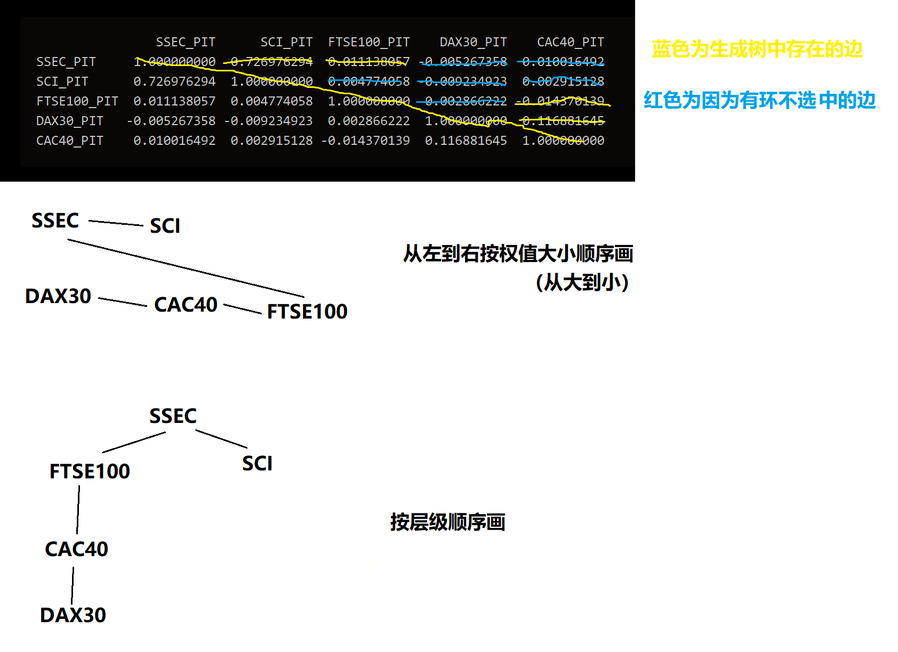

stock copula
========
第一步
------
对收益率
### SSEC
* JB检验： Jarque_beraResult(statistic=5922.418016821695, pvalue=0.0)
* ADF检验： (-9.840797680673846, 4.7594468861661446e-17, 27, 2889, {'1%': -3.432615531267606, '5%': -2.8625409589326205, '10%': -2.5673028391515254}, -21733.928302635803)
* ARCH效应检验：Chi-squared = 380.56, df = 10, p-value < 2.2e-16
### SCI
* JB检验： Jarque_beraResult(statistic=1922.9291939615061, pvalue=0.0)
* ADF检验： (-14.2597311275576, 1.4334971007230296e-26, 13, 2903, {'1%': -3.4326045958386953, '5%': -2.862536129260207, '10%': -2.567300267867621}, -20574.45350851521)
* ARCH效应检验：Chi-squared = 357.91, df = 10, p-value < 2.2e-16
### FTSE100
* JB检验： Jarque_beraResult(statistic=13094.463375384035, pvalue=0.0)
* ADF检验： (-16.826211955918293, 1.167669855767656e-29, 12, 3017, {'1%': -3.4325193312999036, '5%': -2.8624984712561274, '10%': -2.567280219110819}, -23969.535430552045)
* ARCH效应检验：Chi-squared = 698.07, df = 10, p-value < 2.2e-16
### DAX30
* JB检验： Jarque_beraResult(statistic=7339.559305081821, pvalue=0.0)
* ADF检验： (-16.327113802190908, 3.08674593815361e-29, 10, 3033, {'1%': -3.4325078777082796, '5%': -2.8624934125717725, '10%': -2.567277525930013}, -22658.135809125994)
* ARCH效应检验：Chi-squared = 552.41, df = 10, p-value < 2.2e-16
### CAC40
* JB检验： Jarque_beraResult(statistic=8109.087761470604, pvalue=0.0)
* ADF检验： (-20.10586187025487, 0.0, 7, 3065, {'1%': -3.432485329568554, '5%': -2.8624834537243493, '10%': -2.5672722239727066}, -22955.17483627421)
* ARCH效应检验：Chi-squared = 542.23, df = 10, p-value < 2.2e-16

第二步
-----------
ARIMA最优模型
### SSEC
```
ARIMA(5,0,3) with zero mean 

Coefficients:
         ar1     ar2     ar3     ar4      ar5      ma1     ma2      ma3
      0.2987  -0.952  0.1237  0.0157  -0.0173  -0.2660  0.9336  -0.0781
s.e.  0.7602   0.158  0.7119  0.0465   0.0267   0.7602  0.1328   0.7043

sigma^2 = 3.146e-05:  log likelihood = 10984.84
AIC=-21951.67   AICc=-21951.61   BIC=-21897.87
```
### SCI
```
ARIMA(1,0,1) with zero mean 

Coefficients:
          ar1     ma1
      -0.8882  0.9166
s.e.   0.0421  0.0364

sigma^2 = 4.716e-05:  log likelihood = 10391.47
AIC=-20776.95   AICc=-20776.94   BIC=-20759.01
```
### FTSE100
```
ARIMA(5,0,5) with zero mean 

Coefficients:
          ar1     ar2      ar3     ar4     ar5     ma1      ma2     ma3
      -0.1726  0.2969  -0.3699  0.3401  0.7752  0.1639  -0.3170  0.3652
s.e.   0.0850  0.0714   0.1144  0.0638  0.0748  0.0814   0.0646  0.1123
          ma4      ma5
      -0.3882  -0.7517
s.e.   0.0619   0.0880

sigma^2 = 1.966e-05:  log likelihood = 12123.78
AIC=-24225.56   AICc=-24225.47   BIC=-24159.38
```
### DAX30
```
ARIMA(0,0,0) with zero mean 

sigma^2 = 3.161e-05:  log likelihood = 11452.01
AIC=-22902.01   AICc=-22902.01   BIC=-22895.99
```
### CAC40
```
ARIMA(0,0,0) with zero mean 

sigma^2 = 3.081e-05:  log likelihood = 11600.13
AIC=-23198.25   AICc=-23198.25   BIC=-23192.22
```

第三步
------------
用GARCH拟合ARIMA最优模型的残差
### SSEC
* GARCH
```
Coefficient(s):
        mu       omega      alpha1       beta1  
3.9448e-05  2.6822e-07  6.9267e-02  9.2436e-01
```
* ADF检验：Dickey-Fuller = -13.721, Lag order = 14, p-value = 0.01（实际比这个小）
* BDS检验
```
Epsilon for close points =  0.0028 0.0056 0.0084 0.0112 

Standard Normal = 
      [ 0.0028 ] [ 0.0056 ] [ 0.0084 ] [ 0.0112 ]
[ 2 ]     4.9865     7.0757     9.0644    10.4787
[ 3 ]     7.2637     9.9598    12.0665    13.7297

p-value = 
      [ 0.0028 ] [ 0.0056 ] [ 0.0084 ] [ 0.0112 ]
[ 2 ]          0          0          0          0
[ 3 ]          0          0          0          0
```
* CVM检验：omega2 = 962.79, p-value < 2.2e-16

### SCI
* GARCH
```
Coefficient(s):
        mu       omega      alpha1       beta1  
1.8862e-05  6.4036e-07  6.0585e-02  9.2564e-01  
```
* ADF检验：Dickey-Fuller = -13.723, Lag order = 14, p-value = 0.01（实际比这个小）
* BDS检验
```Epsilon for close points =  0.0034 0.0069 0.0103 0.0137 

Standard Normal = 
      [ 0.0034 ] [ 0.0069 ] [ 0.0103 ] [ 0.0137 ]
[ 2 ]     4.0122     5.6464     7.7869     9.8539
[ 3 ]     6.4152     8.3825    10.9933    13.2679

p-value = 
      [ 0.0034 ] [ 0.0069 ] [ 0.0103 ] [ 0.0137 ]
[ 2 ]      1e-04          0          0          0
[ 3 ]      0e+00          0          0          0
```
* CVM检验：omega2 = 960.19, p-value < 2.2e-16

### FTSE100
* GARCH
```
Coefficient(s):
        mu       omega      alpha1       beta1  
2.0300e-04  8.4303e-07  1.3186e-01  8.2164e-01  
```
* ADF检验：Dickey-Fuller = -13.919, Lag order = 14, p-value = 0.01（实际比这个小）
* BDS检验
```
Epsilon for close points =  0.0022 0.0044 0.0066 0.0089 

Standard Normal = 
      [ 0.0022 ] [ 0.0044 ] [ 0.0066 ] [ 0.0089 ]
[ 2 ]    12.0353    12.6627    12.8609    13.2519
[ 3 ]    16.0576    16.4353    16.3417    16.5075

p-value = 
      [ 0.0022 ] [ 0.0044 ] [ 0.0066 ] [ 0.0089 ]
[ 2 ]          0          0          0          0
[ 3 ]          0          0          0          0
```
* CVM检验：omega2 = 1002.4, p-value < 2.2e-16

### DAX30
* GARCH
```
Coefficient(s):
        mu       omega      alpha1       beta1  
2.6919e-04  8.4430e-07  1.0628e-01  8.6675e-01  
```
* ADF检验：Dickey-Fuller = -14.072, Lag order = 14, p-value = 0.01（实际比这个小）
* BDS检验
```
Epsilon for close points =  0.0028 0.0056 0.0084 0.0112 

Standard Normal = 
      [ 0.0028 ] [ 0.0056 ] [ 0.0084 ] [ 0.0112 ]
[ 2 ]    10.0683     9.4842     9.8153     9.2503
[ 3 ]    14.4560    13.5235    13.6332    13.3037

p-value = 
      [ 0.0028 ] [ 0.0056 ] [ 0.0084 ] [ 0.0112 ]
[ 2 ]          0          0          0          0
[ 3 ]          0          0          0          0
```
* CVM检验：omega2 = 1004.8, p-value < 2.2e-16

### CAC40
* GARCH
```
Coefficient(s):
        mu       omega      alpha1       beta1  
2.5779e-04  1.0548e-06  1.3779e-01  8.3029e-01  
```
* ADF检验：Dickey-Fuller = -14.861, Lag order = 14, p-value = 0.01（实际比这个小）
* BDS检验
```Epsilon for close points =  0.0028 0.0056 0.0083 0.0111 

Standard Normal = 
      [ 0.0028 ] [ 0.0056 ] [ 0.0083 ] [ 0.0111 ]
[ 2 ]    12.7196    11.4585    11.0073    10.0493
[ 3 ]    18.3638    16.3068    15.1014    13.9452

p-value = 
      [ 0.0028 ] [ 0.0056 ] [ 0.0083 ] [ 0.0111 ]
[ 2 ]          0          0          0          0
[ 3 ]          0          0          0          0
```
* CVM检验：omega2 = 1014.6, p-value < 2.2e-16

第四步
----------
### Kendall相关度
```
                SSEC_PIT      SCI_PIT  FTSE100_PIT    DAX30_PIT    CAC40_PIT
SSEC_PIT     1.000000000  0.726976294  0.011138057 -0.005267358  0.010016492
SCI_PIT      0.726976294  1.000000000  0.004774058 -0.009234923  0.002915128
FTSE100_PIT  0.011138057  0.004774058  1.000000000  0.002866222 -0.014370139
DAX30_PIT   -0.005267358 -0.009234923  0.002866222  1.000000000  0.116881645
CAC40_PIT    0.010016492  0.002915128 -0.014370139  0.116881645  1.000000000
```
### 配对图


第六步
----------
### 最大生成树的边参数
* SSEC-SCI: family = t, rotation = 0, parameters = 0.99, 4.97（边权值0.726976294）
* DAX30-CAC40: family = bb1, rotation = 180, parameters = 0, 6.56（边权值0.116881645）
* FTSE100-CAC40: family = t, rotation = 0, parameters = 0.97, 5.07（边权值-0.014370139）
* SSEC-FTSE100: family = t, rotation = 0, parameters = 0.97, 5.07（边权值0.011138057）

### 最大生成树结构
